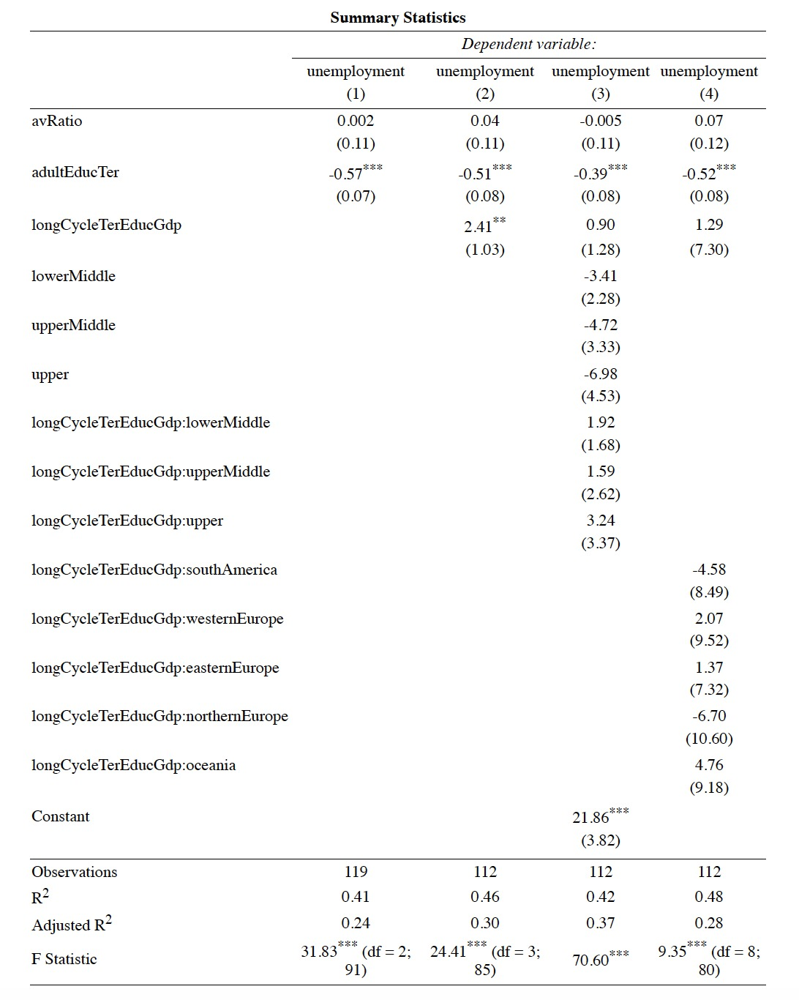
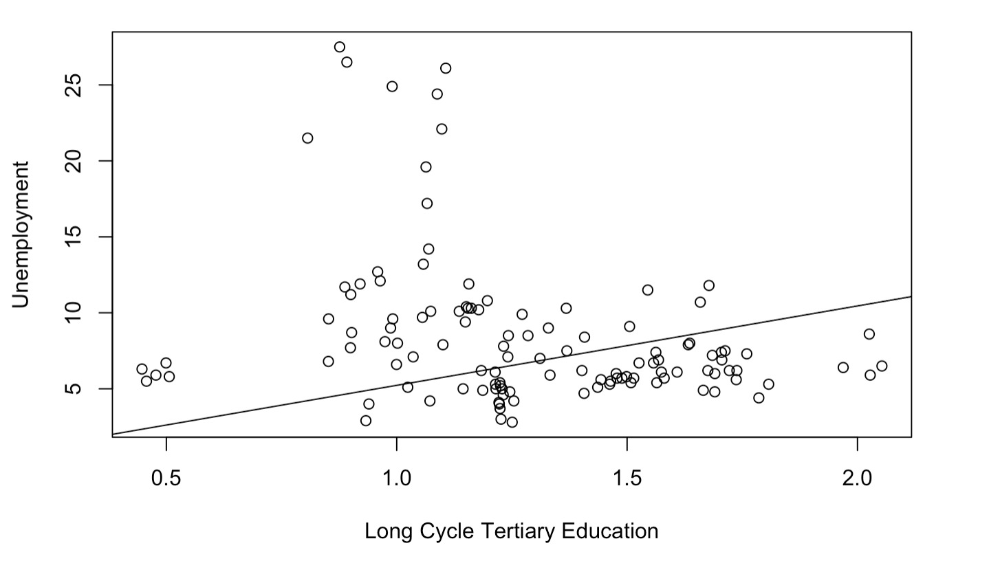
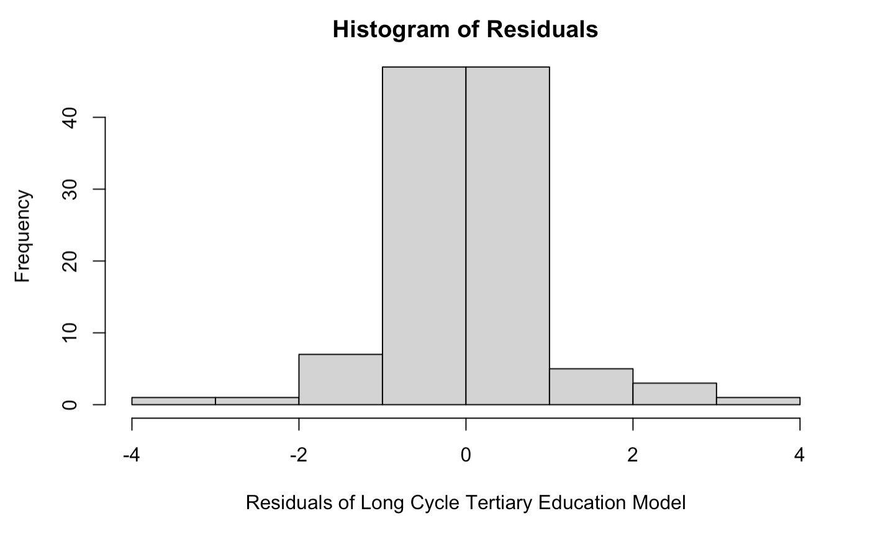

```{r setup, include=FALSE}
knitr::opts_chunk$set(echo = FALSE, message = FALSE, warning = FALSE)
```

# Agenda

1. Research Question
2. Background
3. Research Gap
4. Hypotheses Formulation
5. Methodology
    + Sampling
    + Variables 
6. Data Analysis  
    + EDA 
    + Modeling
    + Validity
7. Discussion
8. Conclusion
    + Limitations
    + Further Research


# Research Question 

**How do government expenditures in different schooling levels impact on unemployment in OECD countries?**  


# Background
Unemployment levels are constantly under the spotlight of governments, as signals of the economic stability of countries and of the effectiveness of the policies they implement. It is conventionally believed that the acquisition of skills enhances the possibilities of getting hired (Grimaccia & Lima, 2013). Previous literature investigated three important relationships: 

<center>

{width=280px}

</center>


# Research Gap 

**A large gap in the literature is found regarding the division of these expenditures among the different educational levels.**

1. It is not investigated whether and how investments in a particular level of education – primary, secondary or tertiary – provide greater benefit on the economy.
2. The literature generally focuses more on specific-countries rather than cross-country studies.

# Our Aim

* To assess whether the expenditure in education is negatively correlated to unemployment levels. 
* To study whether the impact of government expenditures in education on unemployment varies according to the destination of these expenditures – primary, lower and upper secondary, tertiary schooling. 
* To better understand on which educational level governments should direct their investments to reach the best possible outcome for diminishing unemployment.

# Hypothesis Formulation

**Hypothesis 1:** Higher government investments in primary education will lead to lower unemployment rates.

**Hypothesis 2:** Higher government investments in lower secondary education will lead to lower unemployment rates.

**Hypothesis 3:** Higher government investments in upper secondary education will lead to lower unemployment rates.

**Hypothesis 4:** Higher government investments in long-cycle tertiary education will lead to lower unemployment rates.

# Methodology 

## Sampling

* Panel data gathered from the OECD.Stat. 
* Focus on the period from 2013 to 2017. 
* 26 countries out of 38 were included in our sample because of missing data. 
* The sample allows for a cross country analysis.
* Geographical heterogeneity maintained.   

<center>


</center>

# Variables
## Dependent Variable
Level of unemployment

  + Measured as the percentage of the population aged between 24 and 64 years of age that is without employment.  

## Independent Variable
1. The level of total expenditure in primary education (ISCED2011 level 1); 
2. The level of total expenditure in lower secondary education (ISCED2011 level 2); 
3. The level of total expenditure in upper secondary education (ISCED2011 level 3); 
4. the level of total expenditure in long cycle tertiary education (ISCED2011 levels 6 to 8).

Included as percentage of the GDP.

# Variables
## Control Variables
1. Educational attainment

    + Percentage of university graduates in the population aged 25-64.
2. Student-teacher ratio 

    + Number of students per teacher.

# Variables
## Categorical Variables
### Geographical categorization

* South America
* North America
* Western Europe 
* Eastern Europe
* Northern Europe 
* Oceania
* Middle East 
 
### Income categorization

By GDP per capita quartiles. 

* Low income (0 - 26,725.25)
* Lower-middle income (26,725.25 - 33,643)
* Upper-middle income (33,643 - 43,618.75)
* Upper income  (43,618.75 - 87496)


# Data Analysis

## Explanatory data analysis

Panel data of 130 observations 
PUT THE TABLE OF SUMMARY STATISTICS

# Data Analysis

```{r, out.width = "100px", fig.align='center'}

```


# Data Analysis
## Validity 

### Linearity 



# Data Analysis
## Validity 

### Distribution of residuals





# Data Analysis
## Validity 
### Residuals Homoskedasticity 
Breusch-Pagan p-value of 2.2e-16. 

# Discussion
**None of our initial hypotheses can be accepted.** 
Data only highlight a significant and—opposite from what expected—positive relationship between long-cycle tertiary education expenditures and unemployment rates. 

## What does it mean? 
1. The effects of investments in lower grades of schooling are not directly captured by unemployment levels. 

2. The positive relationship between unemployment rates and outlays in long-cycle tertiary education might appear counter-intuitive. 
    + Countries spending more in higher education form more educated individuals
    + Upward pressure to labour supply 
    + Labour surplus leads to an increase in unemployment rates if not matched by a sufficient labour demand

# Conclusions
## Limitations
1. Limited sample (size and period)
2. Income distribution
3. General definition of unemployment rate

## Further Research
1. Broadening the time frame
2. Considering a greater sample of countries—from various regions and with different levels of income
3. Considering as a dependent variable a smaller percentage of the working population
4. Testing different types of relationships – i.e., the logarithmic form

# Thank you

ANY QUESTIONS? 


