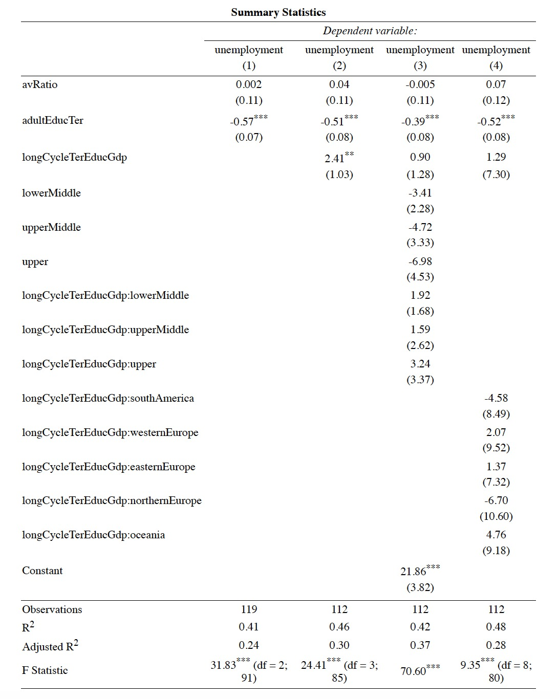

<style>
body {
text-align: justify}
</style>

```{r setup, include=FALSE}
knitr::opts_chunk$set(echo = FALSE, message = FALSE, warning = FALSE)
```

```{r, include=FALSE}
library(gsheet)
library(plm)
library(tidyverse)

mydata <- gsheet2tbl("https://docs.google.com/spreadsheets/d/1zcYomqhibeLyxaeTyJz8etOqUWqDLH_4/edit#gid=550557869")

mydata <- mydata %>% mutate(primEducGdp = primEduc/gdp*100)
mydata <- mydata %>% mutate(lowSecEducGdp = lowSecEduc/gdp*100)
mydata <- mydata %>% mutate(upSecEducGdp = upSecEduc/gdp*100)
mydata <- mydata %>% mutate(longCycleTerEducGdp = longCycleTerEduc/gdp*100)

modelControlF <- plm(unemployment ~  avRatio + adultEducTer,
             data = mydata, index = c("country", "year"), model = "within")
modelLongCycleEducF <- plm(unemployment ~  avRatio + adultEducTer + longCycleTerEducGdp,
             data = mydata, index = c("country", "year"), model = "within")

mydata <- mydata %>% mutate(northAmerica = case_when(region == "North America" ~ 1
                                                      , TRUE ~ 0))
mydata <- mydata %>% mutate(southAmerica = case_when(region == "South America" ~ 1
                                                      , TRUE ~ 0))
mydata <- mydata %>% mutate(westernEurope = case_when(region == "Western" ~ 1
                                                      , TRUE ~ 0))
mydata <- mydata %>% mutate(easternEurope = case_when(region == "Eastern" ~ 1
                                                      , TRUE ~ 0))
mydata <- mydata %>% mutate(northernEurope = case_when(region == "Northern" ~ 1
                                                      , TRUE ~ 0))
mydata <- mydata %>% mutate(oceania = case_when(region == "Oceania" ~ 1
                                                      , TRUE ~ 0))

modelLongCycleTerEducIntALLF <- plm(unemployment ~  avRatio + adultEducTer + longCycleTerEducGdp*northAmerica + longCycleTerEducGdp*southAmerica + longCycleTerEducGdp*westernEurope + longCycleTerEducGdp*easternEurope + longCycleTerEducGdp*northernEurope + longCycleTerEducGdp*oceania,
             data = mydata, index = c("country", "year"), model = "within")

quantile(mydata$gdpph, probs = c(0, 0.25, 0.5, 0.75, 1))

mydata$lowerMiddle<-0
mydata$lowerMiddle[mydata$gdpph>=26725.25&mydata$gdpph<33643]<-1

mydata$upperMiddle<-0
mydata$upperMiddle[mydata$gdpph>=33643&mydata$gdpph<43618.75]<-1

mydata$upper<-0
mydata$upper[mydata$gdpph>=43618.75&mydata$gdpph<=87496]<-1

modelLongCycleTerEducIntIncomeALLR <- plm(unemployment ~  avRatio + adultEducTer + longCycleTerEducGdp*lowerMiddle + longCycleTerEducGdp*upperMiddle + longCycleTerEducGdp*upper,
             data = mydata, index = c("country", "year"), model = "random")
```

# Introduction

Unemployment levels are constantly under the spotlight of governments, as signals of the economic stability of countries and of the effectiveness of the policies they implement. It is conventionally believed that the acquisition of skills enhances the possibilities of getting hired (Grimaccia & Lima, 2013). In fact, expenditures in education are particularly relevant for growth because they ensure a higher educational attainment and improve workers’ skills, thus leading to a more prepared human capital that should be able to face the present harsh working environment. The necessity of educated people is generally an imperative for all countries, both developed and underdeveloped, exactly because of the expected economic benefits arising from them.

Based on this context, our research question is: *how do government expenditures in different schooling levels impact unemployment in OECD countries?*

More specifically, this paper studies the relationship between educational expenditure by level of schooling and unemployment rate in twenty-six OECD countries using yearly data from 2013 to 2017 from the OECD.Stat website. The study investigates the effect of governmental investments as a percentage of GDP at each of the four different levels of education — primary, lower- and upper-secondary, and long-cycle tertiary — on the proportion of people aged 25-64 unemployed in the countries of the sample. Our aim was to broaden the extant literature, which does not explore considerably this distinction. Significant results would allow for suggestions to be made for governments about where to direct their limited resources to reduce unemployment in the most efficient manner.

The work is divided in the following sections: first, a literature review is presented, and the research gap is identified. Then, we formulate the hypotheses we aim to test with the models developed in the methodology section. Finally, the analysis of the data and the discussion of results are presented, and conclusions are drawn.

The analysis did not show any significant results for the impact of expenditures at the first three levels of education. However, the analysis found a positive relationship between long-cycle tertiary education expenditures and unemployment, suggesting that the more governments spend in Bachelor, Master and PhD programs, the higher the level of unemployment. This particular outcome could be justified by the fact that the greater the outlays in education at these levels, the higher the qualified labour supply which, if not equally matched by labour demand, could lead to the upsurge of unemployment. 


# Literature Review

## The Relationship Between Education and Economic Growth 

Extant literature has investigated the positive relationship between education and economic growth. It is widely accepted that, as individuals become more educated, they turn into greater citizens and contribute to the improvement of the general standard of living of society (Obi & Obi, 2014). Moreover, this association has been tested for different countries from developed countries as the United-States (Jorgenson & Fraumeni, 1992) to developing countries, as Tanzania, Zambia (Jung & Thorbecke, 2001), and India (Chandra, 2010). All these scholars have been able to prove that education expenditures have a positive and significant impact on growth. 

Consequently, education is one of the most important destinations of government expenditures in both developed and developing economies as it will, in the long run, transform their human, economic, cultural and social dimensions. In their study, Obi & Obi (2014) highlight that to promote economic growth, the efficient use of labor and capital requires highly trained and skilled individuals. Ensuring that people have access to the best environment in which they can improve and cultivate their talents is for institutions as imperative as investing in other factors of production such as finance, natural resources and physical equipment. Therefore, since citizens acquire their knowledge and develop their skills through education, it is crucial for governments – whose aim is to foster their countries’ economic development – to spend their savings in the academic system. On this last point, Quan & Beck (1987) add that education expenditures contribute to economic progress in two ways: attracting people to remain in the State and increasing workers’ productivity. The latter, by extension, improves citizens’ standard of living, creates job opportunities and promotes more equitable income distribution in the country (Mefteh, Bouhajeb, & Smaoui, 2016). 

Interestingly, Baqir, Harun, & Razani (2017) emphasize the compounding beneficial effect of spending in education. These investments would not only refine labour’s skills today, but they would generate even more skilled workers in the future, capable to satisfy the continuously changing labour market’s requirements. If a government decides to deploy a small portion of its savings to education, dramatic outcomes might occur for the economy, which will face a shortage of skilled labor and become unable to compete at the global level. 

## The Relationship Between Educational Expenditure and Unemployment

Other than the acknowledged impact that education has on economic growth and the general relevance of expenditure in education from governments, it is necessary to examine the long-term impacts on the employment level, which can be considered one of the main objectives of investing in education. Economic growth does not emerge directly from the expenditure in education but, before generating growth, touches various social aspects, among which we must also consider employment. Unemployment is nowadays a strong concern for governments, both for developed and developing countries; while for the first group it is crucial to keep a competitive position, for the second it is even more important to create the so called “human capital” needed to raise domestic economy (Šonje et Al., 2018).  

However, despite the shared belief that public expenditures are necessary to increase the quality of education, also taken into account by Grimaccia & Lima (2013), there are no homogeneous results regarding the impact of public spending on employment levels.  

On one hand, Grimaccia & Lima (2013), studied the 27 European Union countries, showing that higher investments in education lead to higher employment rates. Dachito, Alemu, & Alemu (2020), who studied the influence of government expenditure on unemployment in the Ethiopian context, found a negative correlation not only between expenditure and unemployment but also between expenditure and unemployment growth, validating Keynes’s theory – cited in Dachito, Alemu, & Alemu (2020). Fedderke & Luiz (2006) were able to show the beneficial impact on employment in the long run in South Africa and Zafer, while William, & Leslie (2014) did the same for the United-States.  

On the other hand, other scholars reached conclusions that contrast the previous ones. According to Nurudeen & Usman (2010), education expenditures negatively impact growth and Ahec Šonje, Deskar-Škrbić, & Šonje (2018), analyzing the public expenditure on education per student, showed its inefficiency in affecting unemployment.

## The Importance of Efficient Expenditures in Education

In the previous sections, the positive effect of education expenditures on economic mid-term and log-term growth has been highlighted. However, governments cannot simply invest all their resources on the national academic systems for two main reasons. First, there are other equally important priorities that require considerable spending. Second, sizable public debts and fiscal deficits impose governments to adopt great fiscal responsibility (Ahec Šonje, Deskar-Škrbić, & Šonje, 2018). Therefore, governments need to efficiently allocate public resources to education. For example, EU regulations expect members to provide educational services by minimizing the amount of their individual national savings devoted to this specific sector, so to control public budgets (Agasisti, 2014). 

It might seem that these directives could limit governments from benefiting from better education systems. Nonetheless, spending more in education is not always synonym to higher quality; evidence suggests that a large number of developed countries could actually increase students’ educational level by allocating fewer resources than those actually dedicated to education (Gimenez, Prior, & Thieme, 2007), justifying authorities’ decisions.  

To conclude, in a world with finite resources, choosing the most efficient mix and deciding where to invest to maximize the outcomes is a central concern to many national stakeholders – i.e., politicians, taxpayers, managers. Education efficiency should be seen as a complex circular system in which investments generate opportunities for students to learn. Given those opportunities, students will be better equipped to compete in the job market, and they will perform better, influencing future funding decisions (Flores, 2017). 

## Research Gap

Despite the large amount of  research on the relationship between educational expenditure and both economic growth and unemployment, a large gap in the literature is found regarding the division of these expenditures among the different educational levels. In particular, it is not investigated whether and how investments in a particular level of education – primary, secondary or tertiary – provide greater benefit for the economy. Moreover, the literature generally focuses more on specific-countries rather than cross-country studies, which could be extremely helpful in the view of resource allocation decisions. 

Therefore, the aim of our research is, first of all, to assess whether the expenditure in education is negatively correlated to unemployment levels and, subsequently, to better understand on which educational level governments should direct their investments to reach the best possible outcome for diminishing unemployment. 

# Hypothesis Formulation

The literature review emphasizes the importance of education in fostering countries’ economic growth and the subsequent relevance of government investments in the sector. On the basis of the extant literature and the gap identified, we developed a set of hypotheses in order to study whether the impact of government expenditures in education on unemployment varies according to the destination of these expenditures – primary, lower and upper secondary, tertiary schooling.

## Primary Education

According to the definition of the OECD (2020), primary education is designed to provide children between 5 and 11 years old a sound basic education in reading, writing and mathematics and a basic understanding of some other subjects (OECD).

Investment in primary education depends on the proportion of young males and females of school age in the total population and is the largest share of expenditure on educational institutions. This data is justified by two reasons. First, primary and secondary education are envisaged as a standard public good. Second, especially at the primary and secondary levels, education is perceived as a means to equalize and redistribute social opportunities (Del Boca, Monfardini, & See, 2018; Hatos, 2014). Indeed, because Northern European governments invest more in early education than Southern European ones, cognitive test scores are higher, and inequality is lower. In most OECD countries, the enrollment rates are close to 100% at the primary levels, highlighting the need for governments to invest resources in this education level to provide the necessary basic knowledge to young citizens. This will give them the possibility to build the foundations of their academic and professional career, to contribute to the growth of the country. Hence, we define the following hypothesis:

*Hypothesis 1: Higher government investments in primary education will lead to lower unemployment rates.* 

## Lower Secondary Education

Lower secondary education provides the basics of education in a more specialized way than the primary level. The typical duration is three years, and, in some countries, it represents the final step of compulsory education. On average, across OECD countries, less than 3% of youth are out of school in primary and lower secondary education. The fourth Sustainable Development Goal of the UN focuses on the importance of education and learning to shape a sustainable future, stressing the necessity to provide investments in education. The lower secondary education is particularly relevant for its impact on pupils’ future education; according to Michaelowa (2007), there is a positive relationship between the quality of secondary and tertiary education. 

Therefore, ensuring a smooth transition from lower to upper secondary education is a crucial step that may prevent students from quitting. We define the following hypothesis: 

*Hypothesis 2: Higher government investments in lower secondary education will lead to lower unemployment rates.*

## Upper Secondary Education

According to the definition of the OECD (2020), upper secondary education provides a higher specialisation than at lower secondary level. The attainment of this level of education has become a minimum requirement to be competitive in the modern labor market. Compared to their higher-educated peers, young people who leave school before the completion of the upper secondary education not only have lower job opportunities but tend to have lower social connectedness (OECD, 2019). As primary education, secondary education is perceived as a standard public good and for this reason, a fair amount of governments’ resources must be devoted to its development. Clearly, it is important for the government to verify whether the costs of its investments will be recovered. Since an upper secondary education offers good prospects of employability and tends to translate into higher earnings, governments will be able to receive higher tax income and social contributions. Therefore, we propose the following hypothesis: 

*Hypothesis 3: Higher government investments in upper secondary education will lead to lower unemployment rates.*

## Tertiary Education

Tertiary education is strictly related to a country’s ability to provide specializing skills to future workers. Tertiary education is composed of short cycle and long cycle tertiary programs. The former is highly specific and is usually designed to provide participants with professional knowledge, skills and competencies to either enter the labor market directly or to move to long cycle programs. Long cycle programs, under observation in this study, are composed of the Bachelor, Master and PhD or equivalent levels, which represent the greatest levels of education attainable. 

The benefits of gaining a tertiary degree are numerous, including better salaries and employment likelihood (OECD, 2020). OECD average data for 2019 shows that the employment rates of 25-34 years old passes from 61% for those below upper secondary education to 78% for those with upper secondary education and 85% for tertiary education (OECD, 2020). Although among non-OECD countries, China represents a valid example of the positive effects of investments in education on graduate employment. Indeed, the local government had strongly expanded its investments in higher education starting from 1999 and this led to a boost in graduate employment levels (Bai, 2006). Therefore, we propose the following hypothesis:

*Hypothesis 4: Higher government investments in long-cycle tertiary education will lead to lower unemployment rates.*

# Methodology

We tested the hypotheses using panel data gathered from the OECD.Stat, which reports data from the 38 members of the organization. However, we included only 26 countries in our sample as 12 of the countries were missing too much information to be properly analyzed. This samples allows for a cross country analysis. The sample is constituted of Australia, Austria, Belgium, Chile, Czech Republic, Estonia, France, Germany, Greece, Hungary, Iceland, Ireland, Israel, Italy, Latvia, Lithuania, Luxemburg, the Netherlands, New Zealand, Poland, Slovak Republic, Slovenia, Spain, Sweden, the United-Kingdom and the United-States. Despite the sample of OECD countries being downsized, we were careful to maintain geographical heterogeneity. We decided to limit the scope of our analysis to the period from 2013 to 2017 since they were the five most recent years available.  

All data were collected from the OECD database to ensure coherent measurements, being from the same organization. For detailed explanations demonstrating paths and filters to obtain data, see **Appendix 1**. 

## Dependent Variable

Our dependent variable is the level of unemployment. It is measured as the percentage of the population between 24 and 64 years of age that is without employment.  

## Independent Variables

We consider four independent variables, whose impact on the level on unemployment is tested in the models. The first one is the level of total expenditure in primary education (ISCED2011 level 1); the second one is the level of total expenditure in lower secondary education (ISCED2011 level 2); the third variable is the level of total expenditure in upper secondary education (ISCED2011 level 3); the fourth is the level of total expenditure in long cycle tertiary education (ISCED2011 levels 6 to 8). They are all included in the model as percentage of the GDP of the specific country in order to normalize with respect to the economic development of the different nations. They individually measure the amount of USD invested by all public and private institutions in their specific grade of schooling as percentage of the total gross domestic product. Since the values at the numerator are reported in US dollars at purchasing power parity as the denominator, we obtained coherent percentage values. We expect to find a negative relationship between these independent variables and unemployment rates.  

## Control Variables

Based on the literature, factors other than our four levels of education expenditures might have an impact on unemployment rates and it is necessary to control for them to avoid any potential biases of our estimations. The educational attainment measures the percentage of university graduates in the population aged 25-64 and controls for the social recognition of education. It reflects the importance of education for the local population - i.e., the higher the percentage of people with tertiary education, the greater the recognition of this attainment in the social and labor environment. The student-teacher ratio is used as a proxy for the quality of the schooling system in a specific country. It is assumed that the lower the number of students per teacher, the greater the attention dedicated to each of them. We extracted data for the ratio at all the different educational levels, and then calculated the average among them to attach a single value for each country in the singular years. We did not control for GDP per capita since we have already included this measure in the independent variables’ definition.

## Categorical Variables

We identified two main categorical variables. The first one classifies countries by their geographical region — South America, North America, Western Europe, Eastern Europe, Northern Europe, Middle East and Oceania. We did not distinguish Southern Europe as the three countries that formally belonged to this group — Italy, Spain and Greece — could be grouped in the previously defined categories. In this case, the base category was Middle East. 

The second categorical variable classifies countries by their level of income, according to the GDP per capita. Since, by the classification of The World Bank (2021), they all belong to the high-income cluster, we proceeded with a further division by quartiles and to each of them we associated low-, lower middle-, upper middle-, and upper-income categories. In this case, the base category was low-income countries. 

# Data Analysis

## Explanatory Data Analysis

In **Table 1** a brief summary of our variables is presented, and some key characteristics of the data’s distribution are provided. Starting with the dependent variable — unemployment — the average rate among the 26 countries in the five years under focus is 8.49%, with an interesting minimum value of 2.8% in Iceland in 2017, and a disastrous maximum rate of 27.5% in Greece in 2013, justified by the prolonged crisis that affected the country. Looking at the independent variables, it is relevant to highlight that the primary education is the schooling level in which governments spend the highest percentage of GDP, compared to other levels. The mean of the variable is 1.3% and its maximum is 2.5%; whilst for lower-secondary education they are 0.9% and 1.3% respectively; for upper-secondary education they are 0.97% and 1.63% respectively; for long-cycle tertiary they are 1.28% and 2.05% respectively. Finally, for the control variables, the mean of the average student-teacher ratio is 13.64, meaning that on average, in the countries of our dataset, for each teacher — no matter the educational level — follows 13 students. We must point out that the average of student-teacher ratio is the lowest in lower-secondary education (11.92) and the highest in long-cycle tertiary (15.8). Concerning the educational attainment, the countries’ mean is 34%, implying that on average, in the 26 countries of the sample, 34% of the population has concluded tertiary education. The minimum value is 16.3% in Italy in 2013, and the maximum is 50.9% in Israel in 2017. If associated with unemployment rates, this data highlights that in countries where people are more educated, unemployment rates are lower – i.e., in Israel, to 50.9% tertiary attainment is associated with an unemployment rate of 4.2% in the same year, whilst in Italy to 16.3% the unemployment was 12.1% in the same year.

Concerning the distinction by income level, our 130 observations fall homogeneously in the four categories. Indeed, we had 33,32,32,33 observations for lower, lower-middle, upper-middle and upper income respectively. It is important to highlight that, since we considered a period of five years, some countries have experienced fluctuations of their income levels, measured by GDP per capita. Therefore, in some cases, they changed their categories from one year to another. For example, Italy was classified as lower-middle in 2013, 2014, 2015, 2016 and changed to upper-middle in 2017. For the geographical categorization, we had 9,1,1,4,2,1,8 countries in Eastern Europe, Middle East, North America, Northern Europe, Oceania, South America and Western Europe.  

### Table 1: Summary Statistics

```{r}
summary(mydata[,c(9:16, 22:25)])
```

## Modeling

Our 130 observations were arranged in form of panel data and we used time-series cross-section-based estimation techniques. 

Before regressing the models, we checked whether we needed a fixed-effects or a random-effects model, performing the Hausman test. In all the models summarized in **Table 2**, except for the third one, the test showed a p-value lower 0.05, confirming the need of the fixed effect. For model (3), we used random effect instead. This passage is crucial to remove the effects of time-invariant characteristics and to ensure that the models are truly measuring the impact of the independent variables on the dependent one.  
We started by running model (1) which comprised just the control variables. It highlighted that the level of education attainment is significant at a 99% level (p-value = 7.47e-12), with an attractive accuracy—R-squared of 41.16%. 

We proceeded by adding to the previous model the independent variables one by one.  
Concerning the models which tested the impact of expenditures in primary, lower- and upper-secondary education on unemployment rates, they all provided non-significant results (p-values > 0.10). Therefore, we could not reject the null hypothesis that stated that devoting expenditures in these educational levels would not affect unemployment. Thus, based on this data, our first three hypotheses were rejected. Significant results were obtained in model (2), which tried to linearly represents the relationship between expenditures in long-cycle tertiary education and unemployment rates. The coefficient of the independent variable under focus appeared to be significant at 95% level (p-value = 0.02205) with an improved accuracy with respect to the first model considered—R-squared of 46.28%. 
 
Given the results obtained, we decided to deepen our analysis and verify whether the interaction between the ratio of long-cycle tertiary education expenditure on GDP varied among different income levels and geographical regions. 

Starting with the distinction by economic conditions, model (3) did not suggest any significant effect of our independent variable. There is however a significance of the constant, which represents the lower-income division. However, since our independent variable is not significant in this model, we could not reject the null hypothesis which stated that there were no differences in the effect of long-cycle tertiary education on unemployment by income among countries.

Moving to the division by regions, model (4) did not suggest any significant effect and led to similar conclusions. 

Although only the long-cycle tertiary education models are shown here, models with these divisions were run for all educational level expenditures, looking to see if there may be a significant impact on unemployment in any of the levels according to income or to region. None of the models were significant.

Finally, it was important to verify which of the three models better predicted the relationship we aimed to study. We therefore performed the Wald-test to compare nested models. For the comparison between the model with income categorization and the one with only expenditures in long-cycle tertiary education, the test gave us a p-value of 7.877e-06. This would suggest that adding the Income terms was valuable to the model. This may however be an effect of the constant being significant. Since our independent variable was not significant in this model, we could not say the model is better. This model does not help us study the phenomenon at hand without independent variable significance. Concerning the test between the model with regional categorization and the one with only expenditures in long-cycle tertiary education, we obtained a p-value of 0.6741, meaning  there is no added value by the regional term. Given the results obtained, we could conclude that, despite it including less variables, the model without a regional categorical variable is a better predictor of the relationship we wanted to investigate and that the model with the income categorical variable may be interesting to study under another context but does not show us the relationship we wish to study.

```{r, include=FALSE}
library(lmtest)
waldtest(modelLongCycleEducF, modelLongCycleTerEducIntIncomeALLR, test = "F")
waldtest(modelLongCycleEducF, modelLongCycleTerEducIntALLF, test = "F")
```

### Table 2: Main Models

1) Model with controls

2) Model with controls + Long Cycle Tertiary Education Adjusted for GDP per head

3) Model with controls + Long Cycle Tertiary Education Adjusted for GDP per head + the Income Division

4) Model with controls + Long Cycle Tertiary Education Adjusted for GDP per head + the Region Division

```{r, include=FALSE}
library(stargazer)

stargazer(modelControlF, modelLongCycleEducF, modelLongCycleTerEducIntIncomeALLR, modelLongCycleTerEducIntALLF, type="text", header=FALSE, digits=2, multicolumn = FALSE, out="./table/summarymodelLongCycleEduc.html", title="Summary Statistics",
          notes = "All the commands and algorithms are coded in R 4.0.3")
```

<center>



</center>


## Validity

From the previous results, we concluded that the unique model which provides us with significant outcomes is model (2). It is important to test its validity, hence whether we collected the right data. We looked at three conditions: linearity, distribution and variability of residuals.  

Concerning the linearity condition, plotting long cycle tertiary education expenditure versus unemployment (2) in a Cartesian plane, except for some outliers, the relationship resembled a linear one (Figure 1). To be more confident, we decided to test the quadratic effect. However, the quadratic term was dropped, implying that its effect is null. Hence the model should be linear, increasing its validity. 

To test the distribution of the residuals, they have been plotted in a histogram which represented symmetric residuals around zero (Figure 2). The skewness test gave a g_1 for our residuals smaller than the theoretical threshold 2√6⁄n. This confirmed our first impression from the graph, that there is no skewness, strengthening model’s validity.  

The last condition to be verified was the residuals’ homoskedasticity. We applied the Breusch-Pagan test which gave us a p-value of 2.2e-16 which is much lower the 5% significance level, implying heteroskedasticity. Heteroskedasticity might deeply affect the validity of our findings, however a way to obtain robust coefficients is through the t-test on the latter. Since we obtained a significant beta for our dependent variable in model (2), we were able to mitigate this limitation. 
To conclude, the overall validity of the model was moderate: the tests showed some confidence of linearity, no skewness but the presence of heteroskedasticity. 

### Figure 1: Relationship Between Long Cycle Tertiary Education Expenditures and Unemployment

```{r}
plot(mydata$longCycleTerEducGdp, mydata$unemployment, xlab = "Long Cycle Tertiary Education", ylab = "Unemployment")
m1 <- plm(unemployment ~ longCycleTerEducGdp, data=mydata)
abline(m1)
```

```{r, include=FALSE}
#quadratic effect test
library(plm)
modelLongCycleEducQuadF <- plm(unemployment ~  avRatio + adultEducTer + longCycleTerEducGdp + I(longCycleTerEducGdp)^2, data = mydata, index = c("country", "year"), model = "within")
```

### Figure 2: Histogram of Residuals

```{r}
hist(modelLongCycleEducF$residuals, main = "", xlab= "Residuals of Long Cycle Tertiary Education Model")
```

```{r, include=FALSE}
#skewness test
library(e1071)
skewness(modelLongCycleEducF$residuals)
2*sqrt(6/length(modelLongCycleEducF$residuals))
```

```{r, include=FALSE}
#heteroskedasticity test
library(lmtest)
bptest(unemployment ~ avRatio + adultEducTer + longCycleTerEducGdp + factor(country), data = mydata, studentize = F)
coeftest(modelLongCycleEducF, vcovHC(modelLongCycleEducF, method = "arellano"))
```


# Discussion of Results

From the data analysis just presented it can be concluded that none of our initial hypotheses can be accepted. Indeed, data do not show any significant relationship between governmental spending in primary, lower- and upper-secondary education and unemployment rate. They only highlight a significant and - opposite from what expected — positive relationship between long-cycle tertiary education expenditures and unemployment rates. The results might seem discouraging initially, and no policy recommendations could be elaborated, however, we had the opportunity to gain important insights. First, despite the imperative to provide and spend in lower grades of schooling, the effects of these investments are not directly captured by unemployment levels. Following, the positive relationship between unemployment rates and outlays in long-cycle tertiary education might appear counter-intuitive. However, it tells us that countries which spend more in higher education for more educated individuals put upward pressure to labour supply. If the latter is not matched by a sufficient labour demand, it leads to an increase in unemployment rates, which is the exact mechanism experienced in the countries of our sample.

# Conclusions

## Limitations

Our study shows some limitations. Firstly, data were not available for all the OECD countries and, therefore, we were forced to restrict our analysis to just 26 of them and for the period between 2013-2017. This led us to further limitations when considering possible division among countries, all of them being categorized as high-income by the World Bank. Moreover, our study being one of the firsts to focus on governmental expenditures broken down by different schooling levels, we decided not to distinguish unemployment among different ages but to consider general levels for the workers aged 25-64. Nonetheless, it may be too broad of a group, and it is likely subjected to other factors apart from government spending in education.

## Further Research

Hence, for further research, we suggest broadening the time frame, and considering a greater sample of countries — from various regions and with different levels of income — to increase the generalizability of the study. Secondly, future analysis should consider as a dependent variable a smaller percentage of the working population, preferably focusing on younger individuals to better assess the real impact of expenditures on their hiring possibilities. Lastly, different types of relationships could be investigated – i.e., the logarithmic form. 

On the basis of these considerations, we thoroughly described all the steps made to make our study reproducible and so to be used as a reference for future studies in the field. 

# Bibliography

Agasisti, T. (2014). The Efficiency of Public Spending on Education: an Empirical Comparison of EU countries. *European Journal of Education*, 49(4).

Ahec Šonje, A., Deskar-Škrbić, M., & Šonje, V. (2018). *Efficiency of Public Expenditure on Education: Comparing Croatia with other NMS*. MPRA.

Bai, L. (2006). Graduate Unemployment: Dilemmas and Challenges in China's Move to Mass Higher Education. *The China Quarterly*, 185(128-144).

Baqir, M., Harun, M., & Razani, M. J. (2017). Employment Generated by Government Spending on Education. *International Journal of Academic Research in Business and Social Sciences*, 7(2).

Chandra, A. (2010). *Does Government Expenditure on Education Promote Economic Growth? An Econometric Analysis*. MPRA Working Paper.

Dachito, A. C., Alemu, M., & Alemu, B. (2020). The Impact of Public Education Expenditures on Graduate Unemployment: Cointegration Analysis to Ethiopia. *Journal of International Trade, Logistics and Law*, 6(2).

Fedderke, J., & Luiz, J. (2006). Infrastructure Investment in Long Run Economic Growth: South Africa 1875-2001. *World Development*, 34(6), 1037-1059.

Flores, I. (2017). Modelling Efficiency in Education: How are European Countries Spending their Budgets and What Relation Between Money and Performance. *Sociologia*, 83.

Gimenez, V., Prior, D., & Thieme, C. (2007). Technical Efficiency, Managerial Efficiency and Objective Setting in the Educational System: an International Comparison. *Journal of Operational Research Society*, 58(8), 996-1007.

Grimaccia, E., & Lima, R. (2013). *Public Expenditure on Education, Education Attainment and Employment: a Comparison among European Countries*. Istat, Italy.

Jorgenson, D. W., & Fraumeni, B. M. (1992). Investmeent in Education and U.S. Economic Growth. *The Scandinavian Journal of Economics*, 94, 51-70.

Jung, H., & Thorbecke, E. (2001). *The Impact of Public Education Expenditure on Human Capital, Growth and Poverty in Tanzania and Zambia: A General Equilibrium Approach*. International Monetary Fund.

Mefteh, H., Bouhajeb, M., & Smaoui, F. (2016). *Higher education, Graduate unemployment, Poverty and Economic growth in Tunisia, 1990-2013*. Economic Analysis Working Papers (2002-2010). Atlantic Review of Economics (2011-2016).

Nurudeen, A., & Usman, A. (2010). Government Expenditure and Economic Growth in Nigeria, 1970-2008: A Disaggregated Analysis. *Business and Economics Journal*, 4, 1-11.

Obi, Z. C., & Obi, C. O. (2014). Impact of Government Expenditure on Education: the Nigerian Experience. *International Journal of Business and Finance Management Research*, 42-48.

OECD. (2019). *Education at a Glance 2019: OECD Indicators*. Paris: OECD Publishing.

OECD. (2020). *Education at a Glance 2020: OECD Indicators*. OECD. Paris: OECD Publishing. Tratto da OECD.

Quan, N. T., & Beck, J. H. (1987). Public Education Expenditures and State Economic Growth: Northeast and Sunbelt Regions. *Southern Economic Journal*, 54(2), 361-376.

Zafer, P., William, A. O., & Leslie, S. K. (2014). The Long-term Impact of Educational and Health Spending on Unemployment Rates. *European Journal of Economic and Political Studies*, 7(1), 49-69.

# Appendices 

## Appendix 1

```{r, eval=FALSE, echo=TRUE}

### Paths to be followed to retrieve data

#### Independent variable:  

https://stats.oecd.org/Index.aspx?DataSetCode=EAG_FIN_SOURCE 

Filters: countries in sample / years: 2013-2017 / ISC11: Primary education 
(ISCED2011 level 1) + Lower secondary education (ISCED2011 level 2) + 
Upper secondary education (ISCED2011 level 3) + Long cycle tertiary 
(ISCED2011 levels 6 to 8) / REF_SECTOR: all sectors / 
COUNTERPART_SECTOR: all public and private institutions / 
EXPENDITURE_TYPE: all expenditure types / UNIT_ MEASURE: 
USD Purchasing Power Parity 

#### Control variables: 

GDP per head: 
https://stats.oecd.org/

Path: National Accounts-> annual national accounts -> main aggregates
-> 1.Gross domestic product (GDP) -> GDP per head, US $, 
constant prices, constant PPPs, reference year 2015

Filters: countries in sample / years: 2013-2017 / 
Measure: USD constant prices, 2015 PPPs 


GDP:
https://stats.oecd.org/

Path: National Accounts-> annual national accounts -> main aggregates
-> 1.Gross domestic product (GDP)  -> GDP, US $, current prices, current PPPs,
millions

Filters: countries in sample / years: 2013-2017

Educational attainment: 
https://data.oecd.org/eduatt/adult-education-level.htm#indicator-chart 

Path: Adult Education Level 

Filters: countries in sample / Perspective: Tertiary / time: years: 2013-2017 

Student-teacher ratio: 
https://stats.oecd.org/   
  
Path: Education and training -> education at a glance -> 
teachers and the learning environment -> 
student-teacher ration and average class size. 

Filters: level of education: Primary education (ISCED2011 level 1) +
Lower secondary education (ISCED2011 level 2) +
Upper secondary education (ISCED2011 level 3) +
ISCED2011 levels 6 to 8 / indicator:  Ratio of students to teaching staff 
by type of institutions / reference sector:   All public and private educational 
institutions /countries in sample / year: 2013-2017 


#### Dependent variable: 

Unemployment:
https://stats.oecd.org/  
  
Path: Education and training -> education at a glance -> 
educational attainment and outcomes-> educational attainment and 
labor force status-> Employment, unemployment and inactivity rate of 
25-64 year-olds, by programme orientation 

Filters: indicator: unemployment / Reference year: 2013-2017 / age: 25-64 years 
/ measure: value / ISCED 2011 A education level: All levels of education /
countries in sample
```
